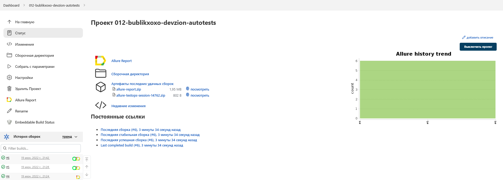
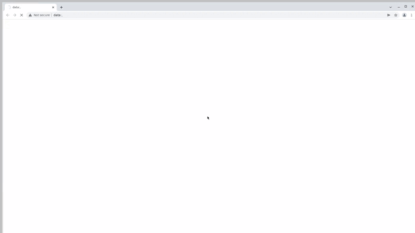

# Автоматизированное тестирование сайта компании ZION Development
## <a target="_blank" href="https://devzion.com">Главная страница ZION Development</a>

## :floppy_disk: Содержание:

- <a href="#computer-технологии-и-инструменты">Технологии и инструменты</a>
- <a href="#notebook_with_decorative_cover-реализованные-проверки">Реализованные проверки</a>
- <a href="#electric_plug-сборка-в-Jenkins">Сборка в Jenkins</a>
- <a href="#arrow_forward-запуск-из-терминала">Запуск из терминала</a>
- <a href="#open_book-allure-отчет">Allure отчет</a>
- <a href="#hammer-allure-testops-отчет">Allure TestOps отчет</a>
- <a href="#wrench-интеграция-с-jira">Интеграция с Jira</a>
- <a href="#robot-отчет-в-telegram">Отчет в Telegram</a>
- <a href="#film_projector-видеопример-прохождения-тестов">Видеопример прохождения тестов</a>

## :computer: Технологии и инструменты
<p align="center">


</p>

## :notebook_with_decorative_cover: Реализованные проверки
- Проверка наличия текста на главной странице
- Проверка наличия QA во вкладке Career

Параметризованные тесты:
- Проверка предложений от компании ZION во вкладке Team

В данном проекте автотесты написаны на <code>Java</code> с использованием <code>Selenide</code> для UI-тестов.

> В качестве библиотеки для модульного тестирования используется <code>JUnit 5</code>.
> 
> Для автоматизированной сборки проекта используется <code>Gradle</code>.
> 
> <code>Selenoid</code> выполняет запуск браузеров в контейнерах <code>Docker</code>.
>
> <code>Allure Report</code> формирует отчет о запуске тестов.
>
> <code>Jenkins</code> выполняет запуск тестов.
> 
> После завершения прогона отправляются уведомления с помощью бота в <code>Telegram</code>.


## :electric_plug: Сборка в Jenkins
##  Главная страница сборки [Jenkins](https://jenkins.autotests.cloud/job/012-bublikxoxo-devzion-autotests/)
<p align="center">

</p>  


## :arrow_forward: Запуск из терминала
Локальный запуск:
```
gradle clean test
```

Удаленный запуск:
```
clean
test
"-DchooseBrowser=${BROWSER}"
"-DsetBrowserSize=${BROWSER_SIZE}"
```
## :open_book: Allure отчет
##  Отчет о результатах тестирования в [Allure Report](https://jenkins.autotests.cloud/job/012-bublikxoxo-devzion-autotests/allure/)
- ### Главный экран отчета
<p align="center">

</p>

- ### Страница с проведенными тестами
<p align="center">

</p>

## :hammer: Allure TestOps отчет
##  Интеграция с [Allure TestOps](https://allure.autotests.cloud/project/1389/dashboards)
<p align="center">

</p>
<p align="center">

</p>
<p align="center">

</p>

## :wrench: Интеграция с Jira
<p align="center">

</p>

## :robot: Отчет в Telegram
##  Уведомления в Telegram с использованием бота
<p align="center">

</p>

## :film_projector: Видеопример прохождения тестов
##  Пример запуска теста в Selenoid
> К каждому тесту в отчете прилагается видео. Одно из таких видео представлено ниже.
<p align="center">
  
</p>
